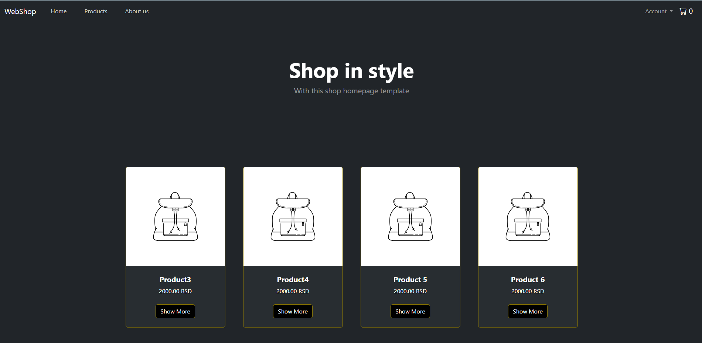
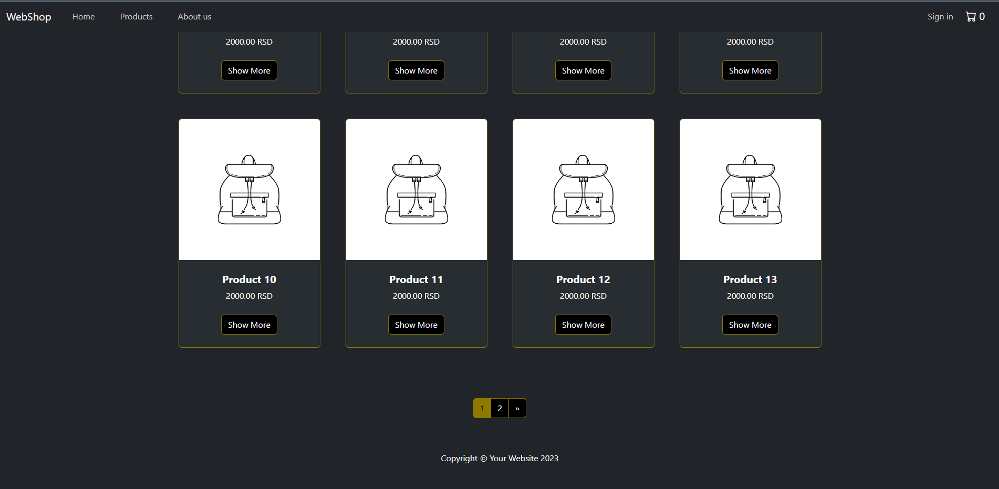
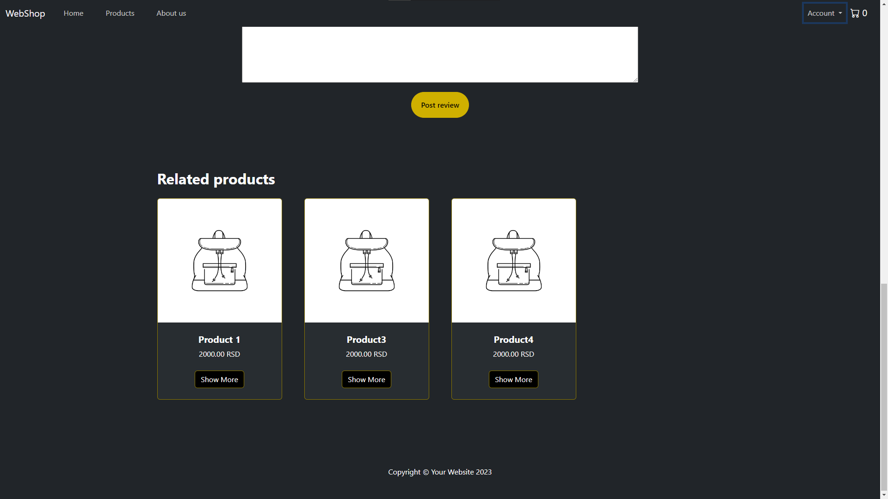
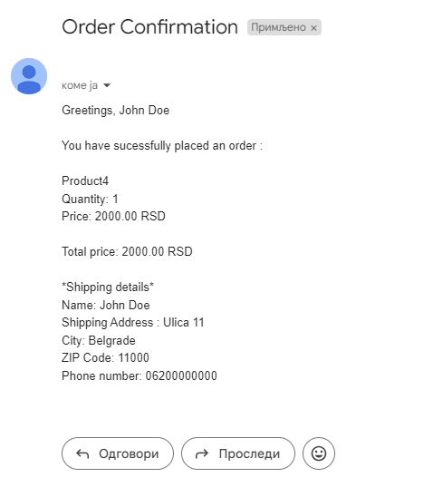

# Spring Boot MVC Fullstack Web Application

## Technologies used
- Java
- Spring Boot
- HTML
- CSS
- JavaScript
- Bootstrap
- MySQL

## Prerequisites
Before running this application, ensure you have the following installed:
- [Java 17](https://www.oracle.com/java/technologies/javase-jdk17-downloads.html)
- [Maven 3.8+](https://maven.apache.org/install.html)
- [MySQL] (https://dev.mysql.com/downloads/installer/)

## How to run project
- Clone project
- Create webshop.sql, update application.properties with your db connection details
- Build the application
- Run app
- Access the application through localhost

### Home Page

### All Products Page pagination

### Product Page

### Empty Cart

### Shopping Cart with cart item

### About us page

### Product add/ Product edit

### Confirmation email to customer and seller

